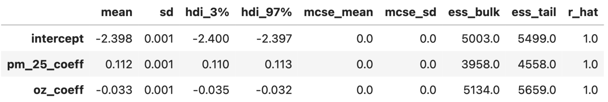
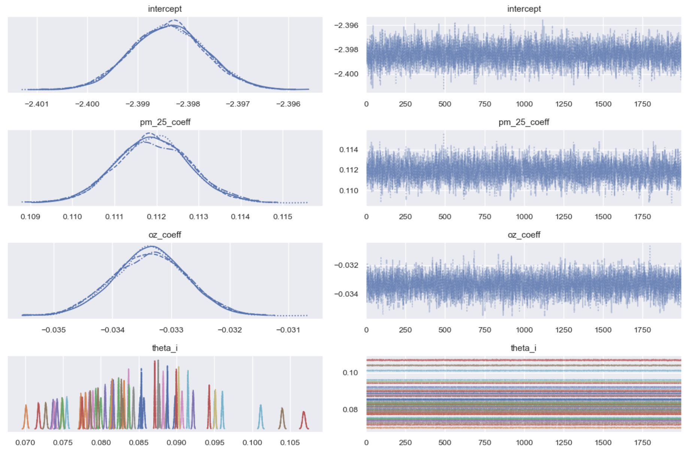
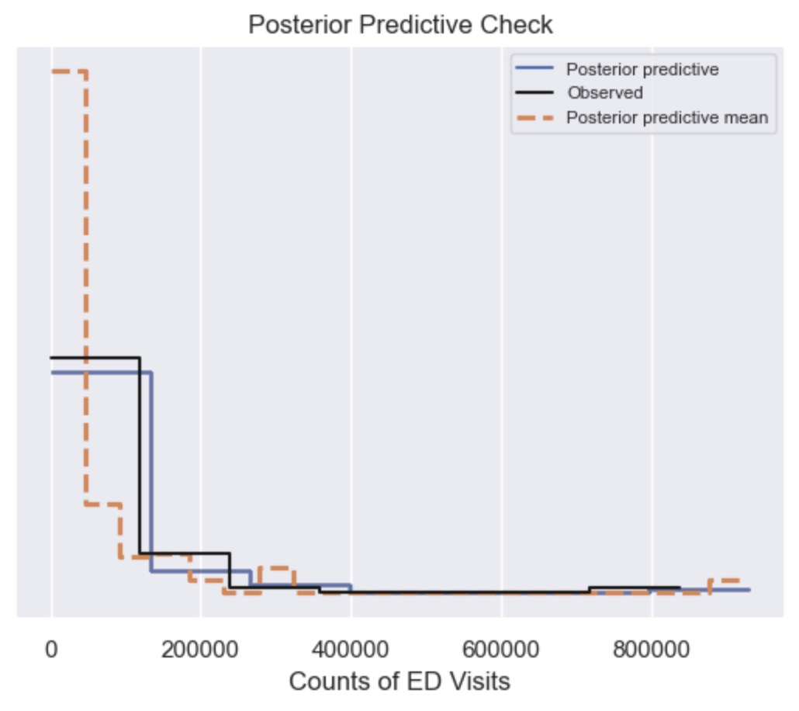
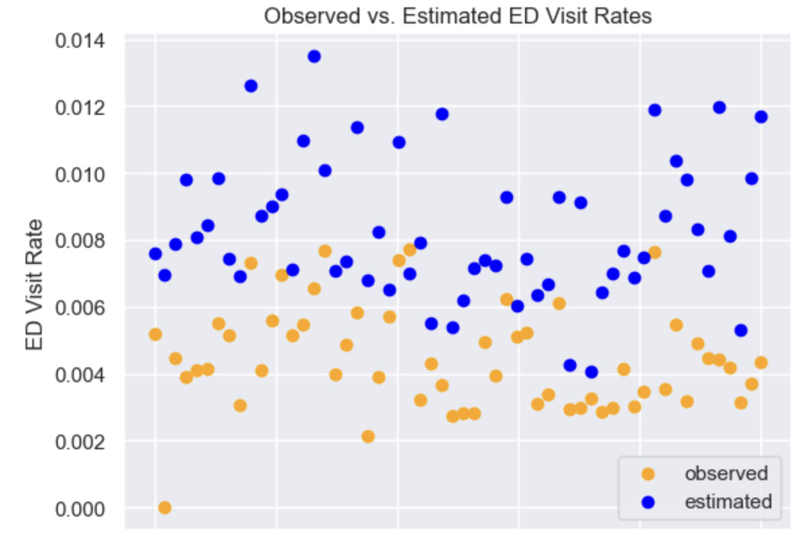

### Background 

Bayesian hierarchical modeling is a robust technique that leverages partial pooling to generate more accurate estimates across various levels of geographical and administrative subdivisions. This project focuses on utilizing Bayesian hierarchical modeling to account for county-level differences to analyze the severity of asthma in regards to PM2.5 and ozone, more generally referred to as common "air pollutants."

 

### Research Question
The California Department of Public Health (CDPH) asthma dashboard notes that emergency department (ED) visits typically occur when individuals with uncontrolled asthma have trouble managing asthma episodes or attacks [1]. As air pollutants are known exacerbators of asthma [2], this project explores the following question: How impactful are PM2.5 and ozone concentration levels alone on the number of ED visits for asthma-related issues in California counties, based on a prior uninformative distributions assigned to the model coefficients in a logistic regression model? 

---

### Methods
The Bayesian hierarchical model is defined as follows:

$$ \beta_0, \beta_1, \beta_2 \sim \text{Uniform}(-\infty, \infty) $$
$$ \theta_i \sim \sigma(\beta_0 + \beta_1 P_i+\beta_2 O_i) $$
$$ X_i \sim \text{Binomial}(A_i, \theta_i) $$

Consistent with the CDPH note that ED visits originate primarily from individuals who have asthma, it is hypothesized that the number of ED visits in a county can be modeled by a binomial distribution with parameters $A_i$ and $\theta_i$, where $A_i$ is the total number of individuals with asthma in county $i$ and $\theta_i$ is the probability that the individual with asthma in county  will visit the emergency department. Other likelihoods were considered for estimating count data, such as the Poisson or Negative Binomial, but the model emphasizes the important fact that the count of ED visits come from a subset of the county population that have asthma (i.e. ED visits come from those at-risk of a major asthma episode, not the entire population), so the binomial likelihood was chosen. The total count of individuals with asthma in each California county, $A_i$, is derived from multiplying the county prevalence of asthma with the average population of each county. In order to study the effects of PM2.5 and ozone concentrations on ED visits, it was initially decided that this is directly related to the probability parameter of the binomial distribution, $\theta_i$. To construct $\theta_i$ as a probability affected by two variables, we defined $\theta_i$ as the sigmoid function applied to the linear predictor $\beta_0 + \beta_1 P_i + \beta_2 O_i$, where $\beta_0$ is an intercept, $\beta_1$ is the coefficient associated with PM2.5 concentration, $\beta_2$ is the coefficient associated with ozone concentration, $P_i$ is the average PM2.5 concentration in county $i$ and $O_i$ is the average ozone concentration in county $i$. As $\beta_1$ and $\beta_2$ are prior distributions of the coefficients in the linear predictor and represent the effects of air pollutants on ED visits, an uninformative prior is chosen to represent each term because the relationship between PM2.5, ozone and ED visits is unknown to us and the coefficients can take on all real values. The uninformative prior is chosen as the prior for the intercept term of the linear predictor for the same reason. Figure 1 shows the graphical model of the scenario, noting the relationships between each of the variables required for this research question.

  

  <strong>Figure 1.</strong> Graphical model of hypothesized relationship between air pollutants and county ED visits.

The Bayesian hierarchical model described was developed using PyMC, a Python library designed for Bayesian modeling. Figure 2 shows the code used to implement the model relating PM2.5 concentration, Ozone concentration and county ED visits. Before implementing the model, the average PM2.5 concentration and average ozone concentrations columns were standardized in order to account for differences in scales of each air pollutant measurement.

  

  <strong>Figure 2.</strong> Python implementation of the hierarchical model using PyMC.

---
### Results
After implementing the model and sampling from the posterior, it is shown that the overall effect of average PM2.5 and ozone concentrations alone did not have a large effect on county ED visits. This result is shown by Figure 3 as the coefficients of the covariates in the linear predictor, $\beta_1$ and $\beta_2$, were 0.054 and -0.006, respectively.

  

  <strong>Figure 3.</strong> Coefficients of the linear predictors.

Model performance was also assessed using the Arviz library to plot the posterior distributions of the random parameters in the model. Figure 4 shows the distribution of the linear predictor intercept, coefficients for PM2.5 and Ozone, and hypothesized county level probabilities of ED visits. The plots to the right of Figure 4 show that convergence was likely reached (shown by "fuzzy" horizontal lines), indicating that the Markov Chain Monte Carlo (MCMC) sampling process was not significantly affected by issues related to properties of the underlying data. 

  

  <strong>Figure 4.</strong> Distribution of Random Parameters in the Bayesian model.

A posterior predictive check (PPC) was also conducted in order to analyze the predictive accuracy of the model. Figure 5 compares the distribution of the observed data with the distribution of samples from the model. The distribution of predictions is very similar to the observed data (indicated by the blue line following closely to the black line) and indicates that the model is fairly accurate, although it has a slightly lower mean.

  

  <strong>Figure 5.</strong> Plot of the posterior predictive check (PPC).

Lastly, the rates of ED visits for all California counties were calculated by dividing the counts of ED visits (for both observed and predicted counts) by the average population of the county. The results are shown in Figure 6, noting similar but slightly elevated ED visit rates in the same range. 

  

  <strong>Figure 6.</strong> Scatter plot comparing observed and estimated ED visit rates.

### Discussion
The statistical techniques involved in Bayesian hierarchical modeling can be used in public health settings to provide more accurate estimates and rates of disease in population-sparse regions by leveraging observed and learned relationships from population-dense regions. The partial pooling method introduced through this application of asthma emergency department visits is intended to provide a justification for public health decision-making, such as determining hospital resource allocation and policy decisions regarding regional healthcare funding, through the use of robust statistical methods. The hierarchical model of this section suggests that the additive county-level effects of PM2.5 and ozone were both not very indicative of a strong effect on asthma attacks or unmanageable episodes resulting in an ED visit (shown by model coefficients close to 0). These results are not completely unexpected as asthma is known to be a complex disorder [3], with various genetic, social and environmental factors affecting susceptibility and severity of symptoms. The current project is helpful in quantifying the effect of two prominent air pollutants, PM2.5 and ozone, on asthma and can give direction for further research into determining the most prominent factors that influence asthma severity.

### Limitations

Limitations of the current Bayesian hierarchical model include the lack of consideration for temporal or seasonal trends. Data for most measures (e.g. PM2.5 concentrations, Ozone concentrations, County populations over the time interval 2016-2019, County asthma prevalence over the time interval 2016-2019) were averaged to ensure 1 row of data per county. This averaging approach assumes that there are negligible differences in any of the measures between years and seasons which, often, is not the case. Another limitation is that the model was trained on county level data, which leaves out potentially important fine-grain spatial relationships to asthma severity due to factors that affect PM2.5 and ozone emissions such as degree of urbanization/industrialization, quality of infrastructure and population density. In addition, this model assumed that average PM2.5 and ozone concentrations were constant throughout a county which may not be the case due to similar spatial relationships that are not accounted for. Further research should explore the dimension of time via time-series analysis and its impacts on the measures, conduct analysis at finer-granularities of data (e.g. at the census-tract or neighborhood level) in order to capture important spatial factors, and consider alternative models, such as multiplicative or nonlinear interactions, of air pollutants on the severity of asthma.

### Conclusion

This project utilized a Bayesian Hierarchical Model to assess the county-level impact of air pollutants alone on ED visits due to asthma in California. The findings from this model suggested a minor effect of PM2.5 and ozone concentrations on emergency visits. These results imply a more limited role of air pollutants in acute asthma exacerbations than previously hypothesized.

---
### References

[1] California Health and Human Services Agency. (n.d.). Asthma emergency department visit rates. Retrieved from https://data.chhs.ca.gov/dataset/asthma-emergency-department-visit-rates

[2] Rennie, J., & Hölzel, C. (2020). Reconsidering the role of manual dexterity in the music performance of string instruments. PLOS ONE, 15(9), e0239185. Retrieved from https://www.ncbi.nlm.nih.gov/pmc/articles/PMC7503605/

[3] European Journal of Clinical Investigation. (2011). The impact of genetic research on our understanding of normal cognitive ageing: 1995 to 2009. European Journal of Clinical Investigation, 41(10), 1007-1021. doi:10.1111/j.1365-2362.2011.02534.x. Retrieved from https://onlinelibrary.wiley.com/doi/10.1111/j.1365-2362.2011.02534.x
